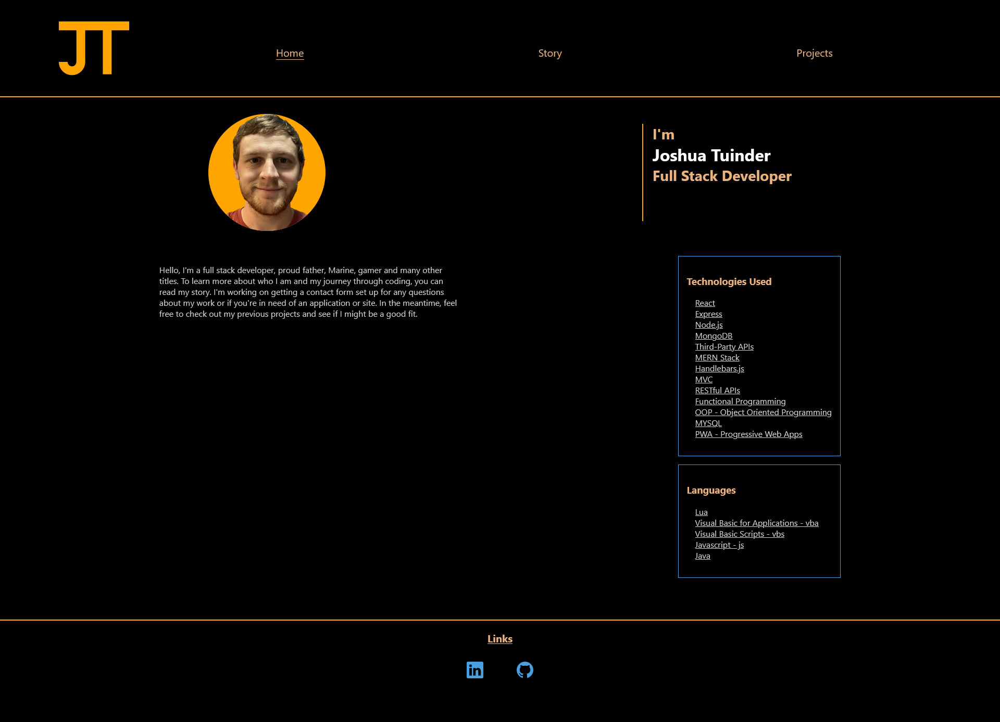

# React Portfolio

## Description

This is my portfolio to host my projects and give some information about myself to anyone that might need my services in the future.

- My motivation for this app was to begin to build my brand and allow potential clients a place to see my work to decide if I can help them.
- I built this project to house all of my projects in one place for easy access.
- While building this app, I learned quite a bit about React and things like state management.

## Table of Contents

- [Installation](#installation)
- [Credits](#credits)
- [License](#license)
- [Questions](#questions)

## Installation

N/A

## Credits

N/A

## License

N/A

## Questions

If you have any questions about this project, [visit my GitHub Profile](https://github.com/TuinderJ/) or [Email Me](mailto:joshua.tuinder@gmail.com)
